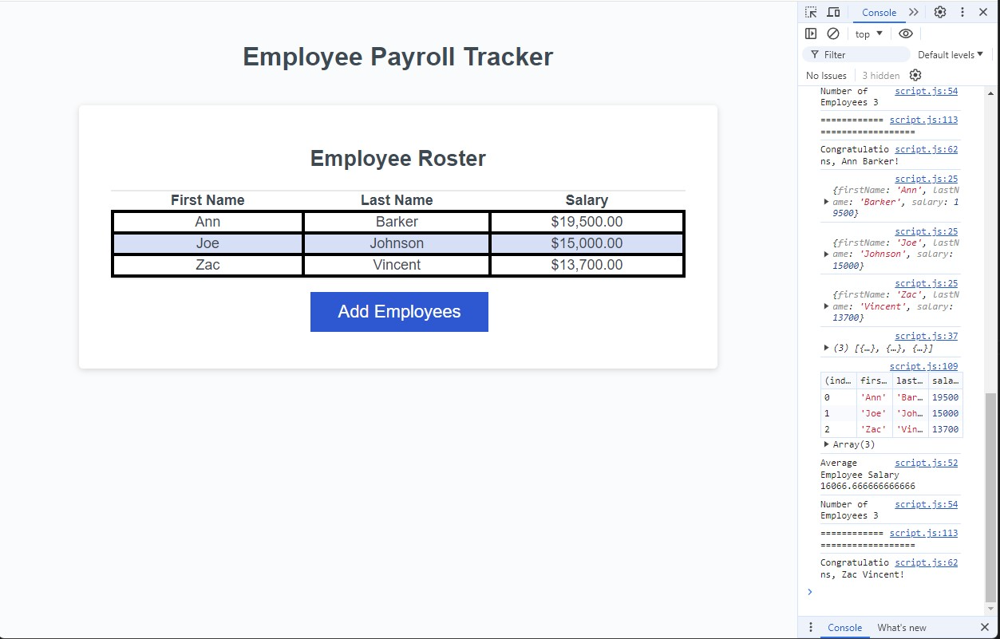

# Module 3 Challenge

This is the JavaScript Challenge. A bit about it:

## User Story:

AS A payroll manager
I WANT AN employee payroll tracker
SO THAT I can see my employees' payroll data and properly budget for the company

## Acceptance Criteria:

GIVEN an employee payroll tracker
WHEN I click the "Add employee" button
THEN I am presented with a series of prompts asking for first name, last name, and salary
WHEN I finish adding an employee
THEN I am prompted to continue or cancel
WHEN I choose to continue
THEN I am prompted to add a new employee
WHEN I choose to cancel
THEN my employee data is displayed on the page sorted alphabetically by last name, and the console shows computed and aggregated data

## Additional Information:

Here is a link to the original source code:
https://github.com/coding-boot-camp/curly-potato

Here is a link to my GitHut repository application:
https://github.com/nobrien1996/module-3-challenge

Here is a screenshot of my deployed application:
